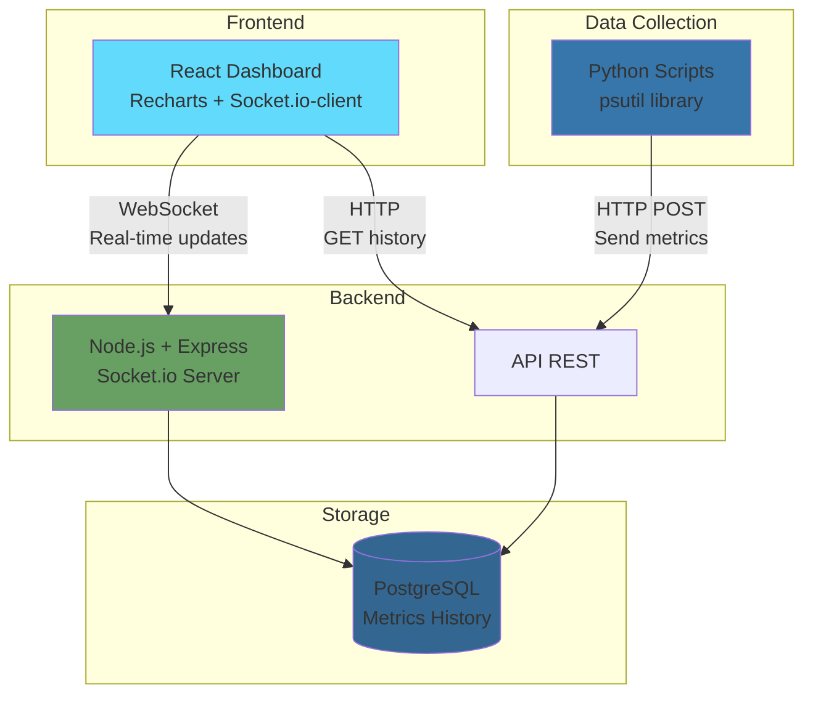
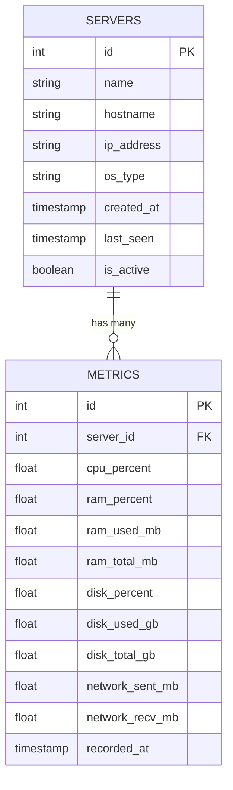
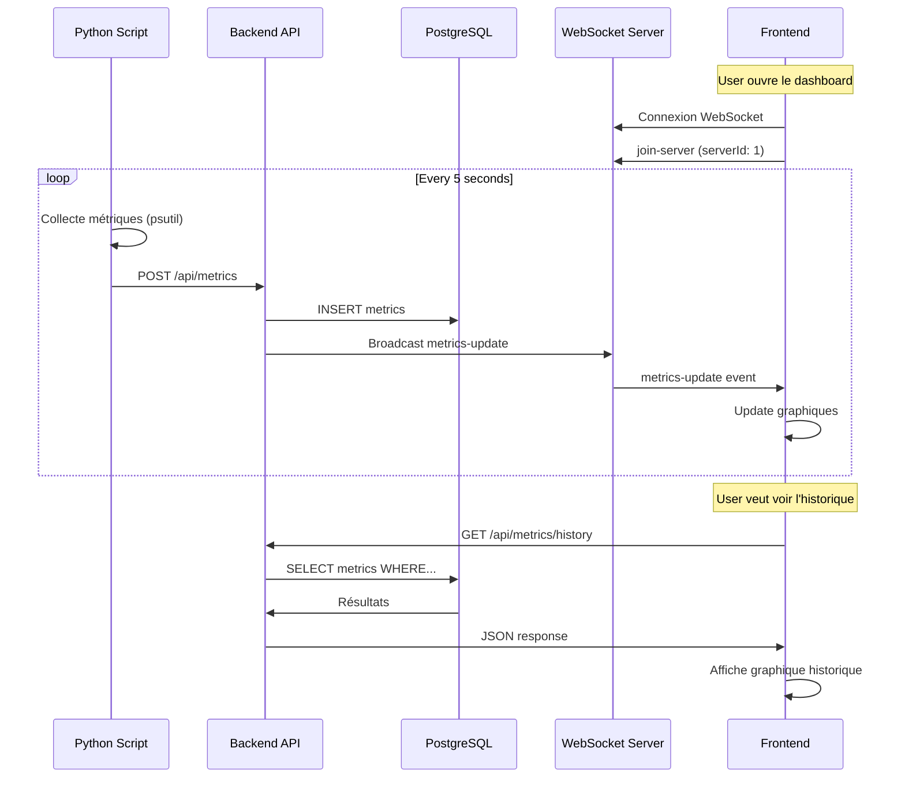

# CONCEPTION - Monitoring Dashboard en Temps Réel

## 1. Architecture Générale



**Description :**
- Le script Python collecte les métriques système toutes les 5 secondes
- Il les envoie au backend Node.js via HTTP POST
- Le backend stocke dans PostgreSQL et broadcast via WebSocket
- Le frontend React reçoit les updates en temps réel et affiche les graphiques

---

## 2. Schéma de Base de Données



**Tables :**

### Table `servers`
Stocke les informations des serveurs monitorés

| Colonne | Type | Description |
|---------|------|-------------|
| id | SERIAL PRIMARY KEY | ID unique du serveur |
| name | VARCHAR(100) | Nom du serveur (ex: "Production Web Server") |
| hostname | VARCHAR(255) | Hostname système |
| ip_address | VARCHAR(45) | Adresse IP |
| os_type | VARCHAR(50) | Type d'OS (Linux, Windows, etc.) |
| created_at | TIMESTAMP | Date d'ajout |
| last_seen | TIMESTAMP | Dernière activité |
| is_active | BOOLEAN | Serveur actif ou non |

### Table `metrics`
Stocke l'historique des métriques

| Colonne | Type | Description |
|---------|------|-------------|
| id | BIGSERIAL PRIMARY KEY | ID unique de la métrique |
| server_id | INTEGER | FK vers servers |
| cpu_percent | DECIMAL(5,2) | % CPU utilisé (0-100) |
| ram_percent | DECIMAL(5,2) | % RAM utilisée (0-100) |
| ram_used_mb | DECIMAL(10,2) | RAM utilisée en MB |
| ram_total_mb | DECIMAL(10,2) | RAM totale en MB |
| disk_percent | DECIMAL(5,2) | % Disque utilisé (0-100) |
| disk_used_gb | DECIMAL(10,2) | Disque utilisé en GB |
| disk_total_gb | DECIMAL(10,2) | Disque total en GB |
| network_sent_mb | DECIMAL(10,2) | Données envoyées (MB) |
| network_recv_mb | DECIMAL(10,2) | Données reçues (MB) |
| recorded_at | TIMESTAMP | Horodatage de la collecte |

**Index pour performance :**
```sql
CREATE INDEX idx_metrics_server_id ON metrics(server_id);
CREATE INDEX idx_metrics_recorded_at ON metrics(recorded_at);
CREATE INDEX idx_metrics_server_time ON metrics(server_id, recorded_at);
```

---

## 3. API REST Endpoints

### Serveurs

**POST /api/servers/register**
Enregistre un nouveau serveur à monitorer
```json
Request:
{
  "name": "Production Server",
  "hostname": "prod-web-01",
  "ip_address": "192.168.1.10",
  "os_type": "Linux"
}

Response: 200
{
  "id": 1,
  "name": "Production Server",
  "created_at": "2025-02-04T10:00:00Z"
}
```

**GET /api/servers**
Liste tous les serveurs
```json
Response: 200
[
  {
    "id": 1,
    "name": "Production Server",
    "hostname": "prod-web-01",
    "ip_address": "192.168.1.10",
    "os_type": "Linux",
    "is_active": true,
    "last_seen": "2025-02-04T10:05:00Z"
  }
]
```

**GET /api/servers/:id**
Détails d'un serveur spécifique

### Métriques

**POST /api/metrics**
Envoie les métriques collectées (appelé par le script Python)
```json
Request:
{
  "server_id": 1,
  "cpu_percent": 45.2,
  "ram_percent": 67.8,
  "ram_used_mb": 6780,
  "ram_total_mb": 10000,
  "disk_percent": 55.3,
  "disk_used_gb": 110.6,
  "disk_total_gb": 200,
  "network_sent_mb": 1250.5,
  "network_recv_mb": 890.3
}

Response: 201
{
  "id": 12345,
  "recorded_at": "2025-02-04T10:05:00Z"
}
```

**GET /api/metrics/current/:serverId**
Récupère la dernière métrique d'un serveur
```json
Response: 200
{
  "server_id": 1,
  "cpu_percent": 45.2,
  "ram_percent": 67.8,
  "disk_percent": 55.3,
  "recorded_at": "2025-02-04T10:05:00Z"
}
```

**GET /api/metrics/history/:serverId**
Récupère l'historique des métriques
```
Query params:
- from: ISO timestamp (ex: 2025-02-04T00:00:00Z)
- to: ISO timestamp (ex: 2025-02-04T23:59:59Z)
- interval: 1m, 5m, 15m, 1h (agrégation)

Response: 200
[
  {
    "cpu_percent": 45.2,
    "ram_percent": 67.8,
    "disk_percent": 55.3,
    "recorded_at": "2025-02-04T10:00:00Z"
  },
  {
    "cpu_percent": 48.1,
    "ram_percent": 68.5,
    "disk_percent": 55.3,
    "recorded_at": "2025-02-04T10:05:00Z"
  }
]
```

### Alertes (optionnel pour MVP)

**GET /api/alerts/:serverId**
Liste les alertes actives pour un serveur

---

## 4. WebSocket Events

### Client → Server

**join-server**
Le client s'abonne aux updates d'un serveur spécifique
```javascript
socket.emit('join-server', { serverId: 1 });
```

**leave-server**
Le client se désabonne
```javascript
socket.emit('leave-server', { serverId: 1 });
```

### Server → Client

**metrics-update**
Nouvelles métriques disponibles
```javascript
socket.on('metrics-update', (data) => {
  // data: { server_id, cpu_percent, ram_percent, ... }
});
```

**server-status**
Changement de statut d'un serveur
```javascript
socket.on('server-status', (data) => {
  // data: { server_id, is_active, last_seen }
});
```

**alert**
Alerte déclenchée (CPU/RAM > seuil)
```javascript
socket.on('alert', (data) => {
  // data: { server_id, type: 'cpu'|'ram'|'disk', value, threshold }
});
```

---

## 5. Flow de Données



---

## 6. Structure du Projet

```
monitoring-dashboard/
├── backend/
│   ├── src/
│   │   ├── config/
│   │   │   └── database.js          # Configuration PostgreSQL
│   │   ├── models/
│   │   │   ├── Server.js             # Modèle Serveur
│   │   │   └── Metric.js             # Modèle Métrique
│   │   ├── routes/
│   │   │   ├── servers.js            # Routes /api/servers
│   │   │   └── metrics.js            # Routes /api/metrics
│   │   ├── controllers/
│   │   │   ├── serverController.js
│   │   │   └── metricController.js
│   │   ├── services/
│   │   │   └── alertService.js       # Logique des alertes
│   │   ├── socket/
│   │   │   └── socketHandler.js      # Gestion WebSocket
│   │   └── app.js                    # Point d'entrée Express
│   ├── migrations/
│   │   ├── 001_create_servers.sql
│   │   └── 002_create_metrics.sql
│   ├── package.json
│   └── .env
│
├── collector/
│   ├── collector.py                  # Script Python
│   ├── config.json                   # Configuration (API URL, interval)
│   └── requirements.txt
│
├── frontend/
│   ├── public/
│   ├── src/
│   │   ├── components/
│   │   │   ├── Dashboard.jsx         # Page principale
│   │   │   ├── MetricsCard.jsx       # Carte pour CPU/RAM/Disk
│   │   │   ├── RealtimeChart.jsx     # Graphique temps réel
│   │   │   ├── HistoryChart.jsx      # Graphique historique
│   │   │   ├── ServerList.jsx        # Liste des serveurs
│   │   │   └── AlertBanner.jsx       # Bannière d'alerte
│   │   ├── services/
│   │   │   ├── api.js                # Appels REST
│   │   │   └── socket.js             # Connexion WebSocket
│   │   ├── utils/
│   │   │   └── formatters.js         # Formatage des données
│   │   ├── App.jsx
│   │   └── index.js
│   ├── package.json
│   └── .env
│
└── README.md
```

---

## 7. Stack Technique Détaillée

### Backend
- **Runtime:** Node.js 18+
- **Framework:** Express 4.x
- **WebSocket:** Socket.io 4.x
- **Base de données:** PostgreSQL 14+
- **ORM:** pg (node-postgres) ou Sequelize (au choix)
- **Validation:** Joi ou express-validator
- **Logging:** Winston
- **Environment:** dotenv

### Frontend
- **Framework:** React 18
- **Build:** Vite ou Create React App
- **Charts:** Recharts 2.x
- **WebSocket:** socket.io-client
- **HTTP:** Axios
- **State:** React Hooks (useState, useEffect, useContext)
- **Styling:** Tailwind CSS (cohérent avec ton portfolio)
- **Date handling:** date-fns ou dayjs

### Collector
- **Language:** Python 3.9+
- **Libraries:**
  - psutil (métriques système)
  - requests (HTTP calls)
  - schedule (scheduling)
- **Config:** JSON ou YAML

### DevOps
- **Backend deployment:** Railway, Render, ou Heroku
- **Frontend deployment:** Vercel ou Netlify
- **Database:** Supabase (PostgreSQL gratuit) ou Render
- **Version control:** Git + GitHub

---


---

## Development Roadmap

Development phases in order:

1. Database setup (PostgreSQL)
2. Backend API (routes + models)
3. Python collector script
4. WebSocket integration
5. Frontend React application
6. Testing and optimization
7. Deployment
